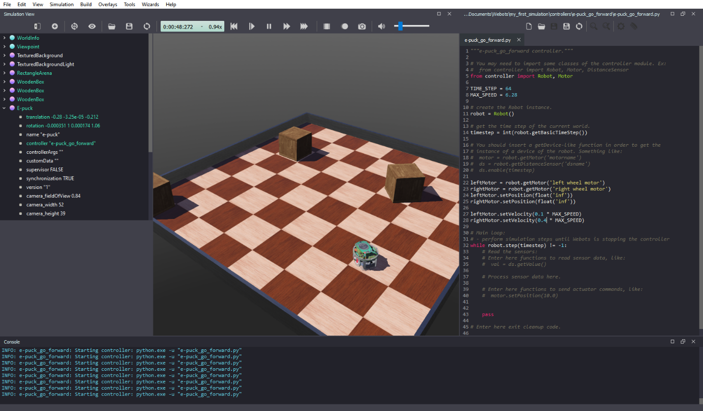
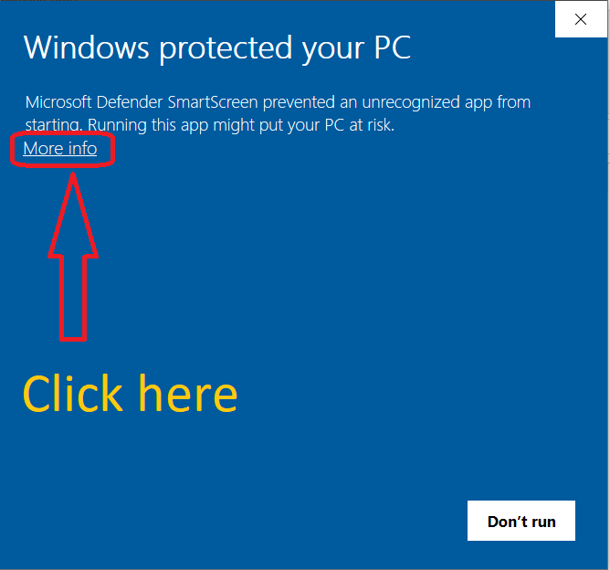
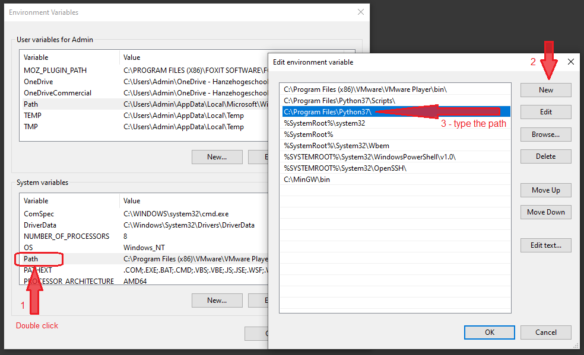

# Lab 1 – Webots Robot Simulator

## Objectives

The goal of this lab is to guide you to install, configure and familiarize yourself with Webots simulator. At the end of this lab you should be able to run Python code to control your simulated robot. 

## Webots
Webots is an open-source robotics simulator that can simulate several types of robots and sensors. It provides a complete development environment to model, program and simulate robots and the world they are in, including physics simulation. It is widely used in industry, education and research. Figure 1 shows a screenshot of Webots.


Figure 1. Webots screenshot.

## Tasks
To complete this lab you have to follow the steps described below. 

1. **Download and install Webots** from [https://cyberbotics.com/](https://cyberbotics.com/). To follow the Robotics Simulation Labs you need **Webots R2022a or newer**. There are versions available for Windows, macOS and Linux. The download and installation process can take a while.
 
2. **Follow all steps of [Webots Tutorial 1](https://cyberbotics.com/doc/guide/tutorial-1-your-first-simulation-in-webots) until and including _Hands-on #7_**. After that, you will need Python (see next instruction).

3. **Install Python 3** (if you don't have it). You need the **64-bit** version of Python 3 to complete the robotics simulation labs with Webots. You can [download Python from here](https://www.python.org/downloads/). When installing Python in Windows, it is recommended to **select the option “Add to PATH” during the installation** to facilitate further configuration of Webots.

_**Note:** Not all Python versions work with all Webots versions! If you are using an older version of Webots (prior to R2023a), you might need to use an older version of Python 3. For example: Webots R2022b works with Python 3.7, 3.8, 3.9 and 3.10, but Webots R2022a does **not** support Python 3.10._ 

4. **Reboot your system** after installing Python.  

5. **Test your Python installation**: Depending on your system, the reference to Python can be via the command `python`, `python3`, `python3.8`, or something similar. To test your Python installation (and to make sure that it is added to Windows PATH, in case of Windows), open the _Command Prompt (cmd)_, _PowerShell_ or _Terminal_ and type `python`, `python3`, or `python3.7` (according to the version that you installed) and hit _ENTER_. If Python is correctly installed (and included on Windows PATH), you should see something similar to:
```
Python 3.10.5 (tags/v3.10.5:f377153, Jun  6 2022, 16:14:13) [MSC v.1929 64 bit (AMD64)] on win32
Type "help", "copyright", "credits" or "license" for more information.
>>>
```
  Type `exit()` and hit _ENTER_ to go back to the terminal/command prompt.

6. **Install libraries** following the instructions [from here](https://cyberbotics.com/doc/guide/using-python#libraries) for your operating system. You need to install at least _NumPy_. Optionally, you can install _OpenCV_, which also installs _NumPy_ (OpenCV is not required for our simulation labs but it is necessary to run some examples that come with Webots). 

7. **Configure Webots to work with Python**: In the Webots menu, go to `Tools > Preferences > Python command` and set it to `python` or `python3` (whatever worked in the step above) to point Webots to your Python installation. If you are on macOS or you haven't added Python to Windows PATH, you will need to indicate the full path in which Python is installed on your computer. Refer to [this page](https://datatofish.com/locate-python-windows/) for instructions on how to find where Python is installed on Windows. If needed, [see installation details here](https://cyberbotics.com/doc/guide/using-python#installation).

8. **Finish Webots Tutorial 1**, continuing from the section ["Create New Controller"](https://cyberbotics.com/doc/guide/tutorial-1-your-first-simulation-in-webots?tab-language=python#create-a-new-controller) until _Hands-on #10_. Webots Tutorial presents examples in several programming languages. Make sure that `Python` is selected when reading the code. 

## Known issues and solutions

This section contains some extra information that can help you solve issues you might encounter during Webots installation or usage.

1- If you are getting error messages when trying to run Python code in Webots, make sure you have the **64-bit** version of Python, and one of the compatible Python versions. 32-bit or wrong versions of Python do not work properly with Webots.

2- If you are using macOS, you might need to use the full Python path in Webots. [See details here](https://cyberbotics.com/doc/guide/using-python#macos-installation).

3- If you are using Linux, Webots might have problems accessing your project folder via symbolic links. A possible solution is to create a folder for the Webots projects on your home partition under your own user name. Another possibility is to install the APT version of Webots. Instructions on how to install the APT version can be found on [this link](https://www.cyberbotics.com/doc/guide/installation-procedure) (Thanks to Nick Buls for the tip).

4- If you are using Windows, you might see a message similar to the one below when you try to run Webots installation program. If this happens, just click on “More info” and then click the button “Run anyway” to proceed with the installation (see figure below).

  


5- If you **already installed Python** but cannot load it from the terminal/command prompt or if Webots cannot find it, you can add Python to Windows PATH system variable. To add Python to PATH, follow the instructions available [in this link](https://datatofish.com/add-python-to-windows-path/). **After you add Python to PATH you must reboot your system for the changes to take effect.** Note that you have to add only the path for the location where the executable is, without including "python.exe". A proper configuration is shown in the image below (the path in your computer might be different depending on your Python version and installation):




6- Depending on your hardware, when running Webots you might see a warning message like: 

```
WARNING: System below the minimal requirements.
Webots has detected that your system features an Intel GPU. A recent NVIDIA or AMD graphics
adapter is highly recommended to run Webots smoothly. 
 - Shadows have been deactivated.
 - Anti-aliasing has been deactivated.
```

This is not a problem for the simulations in the labs described here. The demo simulations that come with Webots can be quite heavy, though. If necessary, there are a couple of things that you can do to reduce the amount of computing power required by Webots:
- On the left side of the window, click on `WorldInfo`. Then, select `FPS` and reduce it to 20 (for example). This reduces the number of frames per second.
- Still in `WorldInfo`, click on `basicTimeStep` and increase it (for example, to 32).
- Go to `Tools -> Preferences -> OpenGL` and try to reduce `Ambient Occusion` and `Texture Quality`.


## Conclusion
After following the steps above, you should have Webots installed and configured to run Python code. You should know the fundamental concepts of Webots and how to write a simple program in Python to control a simulated robot.

In the following lab activities, we will control the virtual robot using Python.

## Next Lab
Go to [Lab 2](../Lab2/ReadMe.md) - Line-following behavior with State-Machine.

Back to [main page](../README.md).
