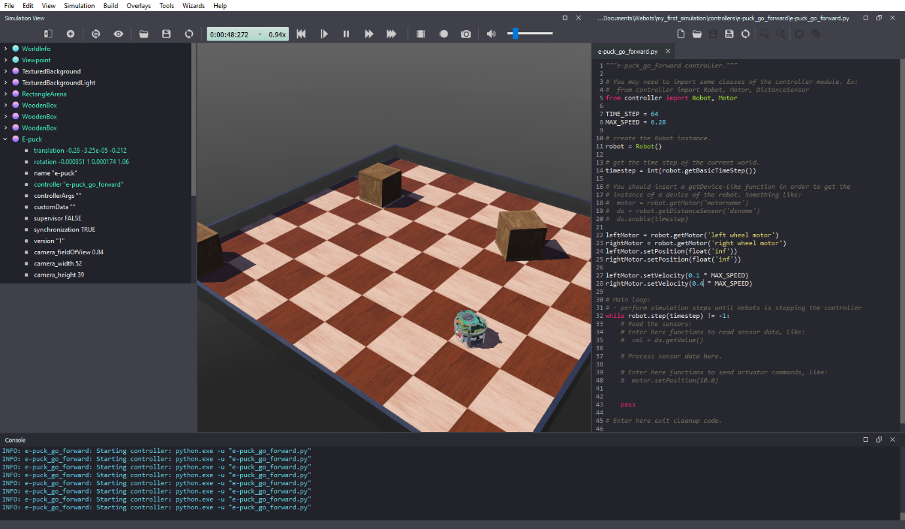
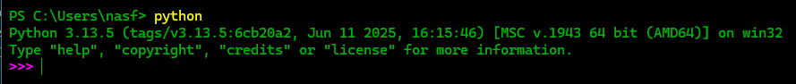
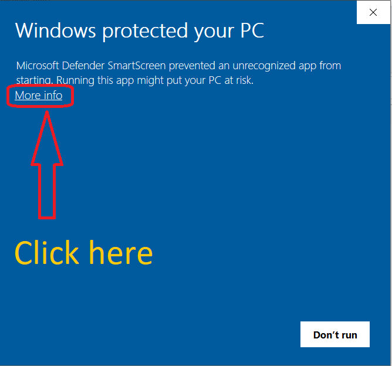
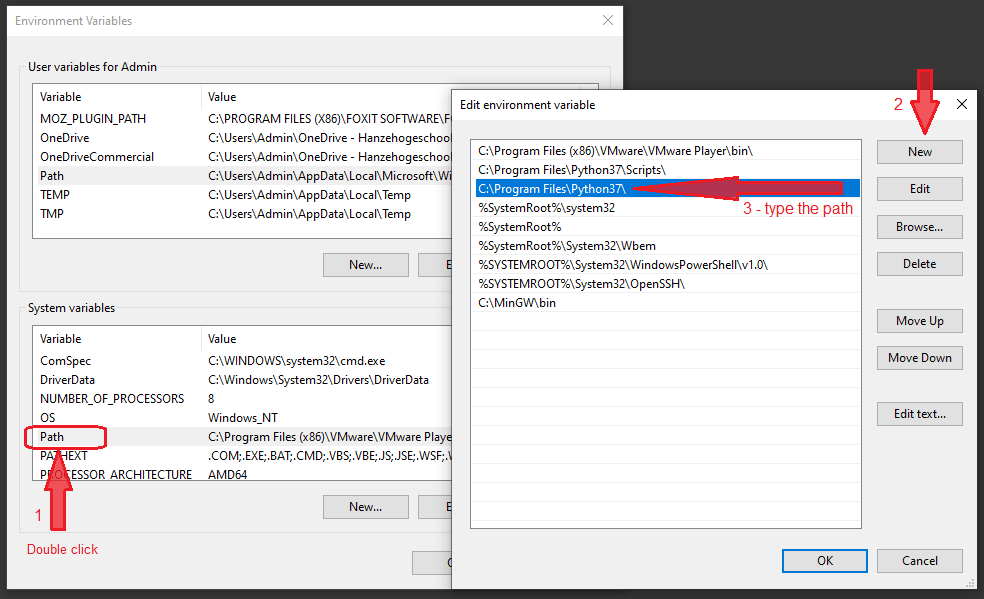

# Lab 1 – Webots Robot Simulator

## Objectives

The goal of this lab is to guide you to install, configure and familiarize yourself with Webots simulator. At the end of this lab you should be able to run Python code to control your simulated robot. 

## Webots
Webots is an open-source robotics simulator that can simulate several types of robots and sensors. It provides a complete development environment to model, program and simulate robots and the world they are in, including physics simulation. It is widely used in industry, education and research. Figure 1 shows a screenshot of Webots.


Figure 1. Webots screenshot.

## Tasks
The Robotics Simulation Labs require Python3 and Webots. To complete this lab, you need to follow the steps described below. 

### 1. **Install Python 3** (in case you already have it, go to step 3).

#### **Windows**
1. You need the **64-bit** version of Python 3, which you can [download Python from here](https://www.python.org/downloads/)

 -  _**Note (a):** When installing Python in Windows, it is highly recommended to **select the option “Add to PATH” during the installation** to facilitate further configuration of Webots._

 - _**Note (b):** Not all Python versions work with all Webots versions! If you are using an older version of Webots (prior to R2023a), you might need to use an older version of Python 3. For example: Webots R2022b works with Python 3.7, 3.8, 3.9 and 3.10, but Webots R2022a does **not** support Python 3.10._

2. **Reboot your system** after installing Python.  

#### **MacOS**
[Download and install Python from here](https://www.python.org/downloads/)

#### **Linux**
Most distributions come with Python pre-installed. **If you are unsure - look up if your distribution comes with Python installed**.

### 2. **Test your Python installation**:
Depending on your system, the command to run Python can be `python`, `python3`, `python3.13`, or something similar.

#### **Windows**
To test your Python installation (and to make sure that it is correctly added to Windows PATH), open  _Command Prompt (cmd)_, _PowerShell_ or _Terminal_ and type `python` or `python3` (in some cases, `python3.xx`, where 3.xx indicates the version that you installed) and hit _ENTER_. You can try all three variations to check which one works. If Python is correctly installed, you should see something similar to the output I get in my computer:



Type `exit()` and hit _ENTER_ to go back to the terminal/command prompt.

#### **MacOS/Linux**
To test your Python installation, open the terminal (on MacOS: `Cmd+Space`, type `Terminal` and press `"Enter"`) type:
```
python3 --version
```
or
```
python --version
```
The result should look similar to this:


### 3. **Install Python libraries**.
You need to install at least _NumPy_. Optionally, you can install _OpenCV_, which also installs _NumPy_ (OpenCV is not required for our simulation labs but it is necessary to run some examples that come with Webots).
#### **Windows**

To install both libraries, open  _Command Prompt (cmd)_, _PowerShell_ or _Terminal_ and type:
```
pip install opencv-python
```
If you want to install NumPy only, type:
```
pip install numpy
```

#### **MacOS**
To install Numpy only, open the `Terminal` and type:
```
pip install numpy --user
```
To install OpenCV, type:
```
pip install opencv-python --user
```

#### **Linux**
== **IF USING DEBIAN BASED DISTRIBUTION** ==
To install Numpy only, open the `Terminal` and type:
```
sudo pip install -numpy
```
To install OpenCV, type:
```
sudo pip install -opencv-python
```
== **OTHER DISTROS - CONTINUE AS IS, SETUP ON STEP 5** ==

### 4. **Download and install Webots** from [https://cyberbotics.com/](https://cyberbotics.com/).
To follow the Robotics Simulation Labs you need **Webots R2022a or newer**.
#### **Windows**
1. Download the installer from the website.
2. Open it and proceed with the setup.
#### **MacOs**
1. Download the app from the website.
2. Drag it to the `Applications` folder.
#### **Linux**
##### **For Debian-based distributions**
1. install the [Cyberbotics.asc](https://cyberbotics.com/Cyberbotics.asc) signature file using this command:
```bash
sudo mkdir -p /etc/apt/keyrings
```
---
```bash
cd /etc/apt/keyrings
```
---
```bash
sudo wget -q https://cyberbotics.com/Cyberbotics.asc
```
2. Configure your APT package manager by adding the Cyberbotics repository:
```bash
echo "deb [arch=amd64 signed-by=/etc/apt/keyrings/Cyberbotics.asc] https://cyberbotics.com/debian binary-amd64/" | sudo tee /etc/apt/sources.list.d/Cyberbotics.list
```
---
```bash
sudo apt update
```
##### **For Other Linux Distros**
1. Look up if you have Flatpak package manager installed in your distribution. If not - go to https://flatpak.org/setup/ and install it.
2. Reboot your system.
3. After reboot, open the terminal, and type:
```bash
flatpak install flathub com.cyberbotics.webots
```
3. Webots should now be available in your app launcher/menu. Alternatively you can launch it by typing
```
flatpak run com.cyberbotics.webots
```
in the terminal

### 5. **Configure Webots to work with Python**:
#### **Windows** 
Once Webots is open, go to `Tools` in top left corner, click `Preferences` , find `Python command` line in the opened window, and set it to `python3` to point Webots to your Python installation. 
#### **MacOS**
Once Webots is open, go to `Tools` in top left corner, click `Preferences` , find `Python command` line in the opened window, and set it to `usr/bin/python3` to point Webots to your Python installation. 
#### **Linux**
##### == **DEBIAN** ==
Once Webots is open, go to `Tools` in top left corner, click `Preferences` , find `Python command` line in the opened window, and set it to `python3` to point Webots to your Python installation. 
##### == **FLATPAK** ==
Open the terminal, run:
```
flatpak run --command=python3 com.cyberbotics.Webots -m ensurepip
```
then:
```
flatpak run --command=python3 com.cyberbotics.Webots -m pip install numpy
```
and:
```
flatpak run --command=python3 com.cyberbotics.Webots -m pip install opencv-python
```
This way you have installed OpenCV and NumPy libraries into the webots flatpak. Reboot Webots if you launch it, then launch it, go to `Tools` in top left corner, click `Preferences` , find `Python command` line in the opened window, and set it to `python3` to point Webots to your Python installation. 
### 6. **Follow all steps of [Webots Tutorial 1](https://cyberbotics.com/doc/guide/tutorial-1-your-first-simulation-in-webots)**. 
Webots Tutorial presents examples in several programming languages. Remember to **select `Python`** when reading the code!
## Instructions might be slightly different on the official website. Please, [see details here](https://cyberbotics.com/doc/guide/using-python#libraries).

## Known issues and solutions

This section contains some extra information that can help you solve issues you might encounter during Webots installation or usage.

1- If you are getting error messages when trying to run Python code in Webots, make sure you have the **64-bit** version of Python, and one of the compatible Python versions. 32-bit or wrong versions of Python do not work properly with Webots.

2- If you are using macOS, you might need to use the full Python path in Webots. [See details here](https://cyberbotics.com/doc/guide/using-python#macos-installation).

3- If you are using Linux, Webots might have problems accessing your project folder via symbolic links. A possible solution is to create a folder for the Webots projects on your home partition under your own user name. Another possibility is to install the APT version of Webots. Instructions on how to install the APT version can be found on [this link](https://www.cyberbotics.com/doc/guide/installation-procedure) (Thanks to Nick Buls for the tip).

4- If you are using Windows, you might see a message similar to the one below when you try to run Webots installation program. If this happens, just click on “More info” and then click the button “Run anyway” to proceed with the installation (see figure below).
<center>

</center>


5- If you **already installed Python** but cannot load it from the terminal/command prompt or if Webots cannot find it, you can add Python to Windows PATH system variable. To add Python to PATH, follow the instructions available [in this link](https://datatofish.com/add-python-to-windows-path/). **After you add Python to PATH you must reboot your system for the changes to take effect.** Note that you have to add only the path for the location where the executable is, without including "python.exe". A proper configuration is shown in the image below (the path in your computer might be different depending on your Python version and installation):




6- Depending on your hardware, when running Webots you might see a warning message like: 

```
WARNING: System below the minimal requirements.
Webots has detected that your system features an Intel GPU. A recent NVIDIA or AMD graphics
adapter is highly recommended to run Webots smoothly. 
 - Shadows have been deactivated.
 - Anti-aliasing has been deactivated.
```

This is not a problem for the simulations in the labs described here. The demo simulations that come with Webots can be quite heavy, though. If necessary, there are a couple of things that you can do to reduce the amount of computing power required by Webots:
- On the left side of the window, click on `WorldInfo`. Then, select `FPS` and reduce it to 20 (for example). This reduces the number of frames per second, which increases simulation speed.
- Still in `WorldInfo`, click on `basicTimeStep` and increase it (for example, to 32). This will increase simulation speed, but it will reduce its accuracy.
- Go to `Tools -> Preferences -> OpenGL` and try to reduce `Ambient Occusion` and `Texture Quality`.


## Conclusion
After following the steps above, you should have Webots installed and configured to run Python code. You should know the fundamental concepts of Webots and how to write a simple program in Python to control a simulated robot.

In the following lab activities, we will control the virtual robot using Python.

## Next Lab
In the next lab you will learn more about controllers in Webots. You will also investigate sensor values, test motors and implementat a finite-state machine to make the robot follow a line.

Go to [Lab 2](../Lab2/ReadMe.md) - Line-following behavior with State-Machine.

Back to [main page](../README.md).
