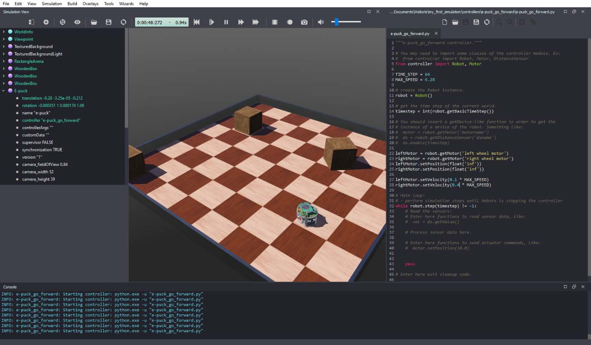
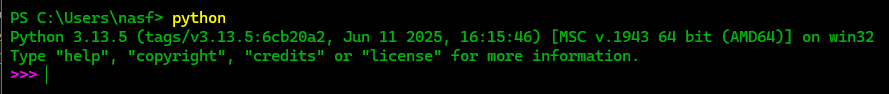
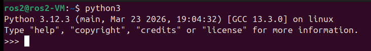
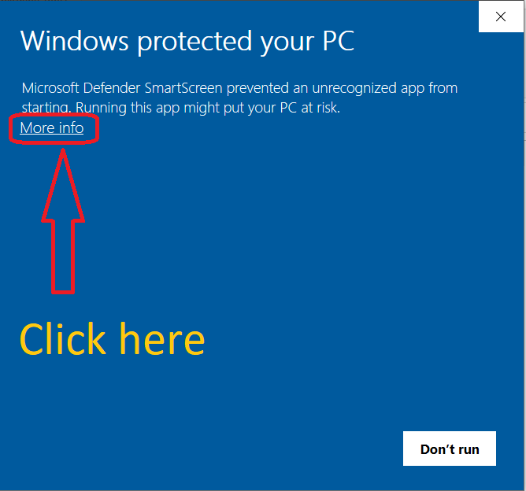
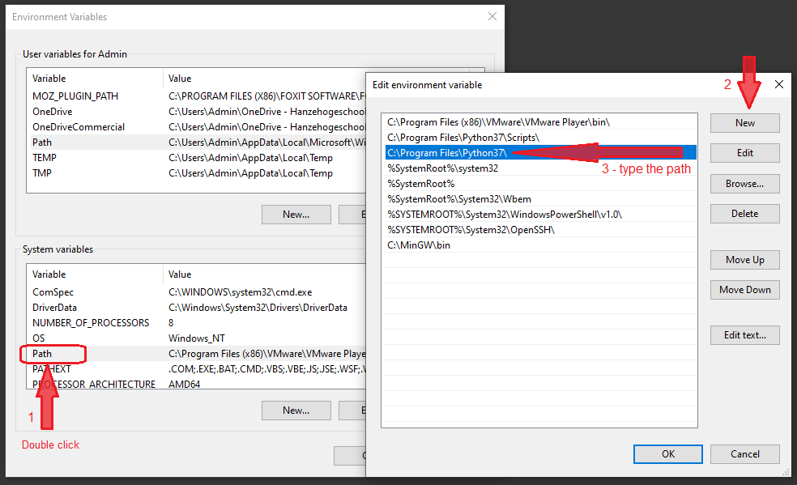

# Lab 1 – Webots Robot Simulator

## Objectives

The goal of this lab is to guide you to install, configure and familiarize yourself with Webots simulator. At the end of this lab you should be able to run Python code to control your simulated robot.

## Webots

Webots is an open-source robotics simulator that can simulate several types of robots and sensors. It provides a complete development environment to model, program and simulate robots and the world they are in, including physics simulation. It is widely used in industry, education and research. Figure 1 shows a screenshot of Webots.


Figure 1. Webots screenshot.

## Tasks

To complete this lab, you need to follow the steps below according to your operating system.

### 1. **Verify your installation**

The Robotics Simulation Labs require a 64-bit version of Python3 to run with Webots. Depending on your system, the command to run Python can be `python`, `python3`, `python3.13`, or something similar. Follow the steps below to check if you already have a compatible version of Python 3 installed.

#### **Windows**

To test your Python installation (and to make sure that it is correctly added to Windows PATH), open  _Command Prompt (cmd)_ or _PowerShell_, type `python` and hit _ENTER_. If Python is correctly installed, you should see something similar to the output below:



Type `exit()` or `exit` and hit _ENTER_ to go back to the terminal/command prompt.

If you have a 64-bit version of Python 3.7 or above installed, skip to step 3. Otherwise, continue to step 2.

#### **MacOS/Linux**

To test your Python installation, open a terminal (on MacOS: `Cmd+Space`, type `Terminal` and press `"Enter"`), type `python3` and hit _ENTER_ (in some cases, the command to call Python 3 can be `python` or even `python3.xx`, where 3.xx indicates the version that you installed).

If Python is correctly installed, you should see something similar to the output below:



If you have a version of Python 3.7 or above installed, skip to step 3. Otherwise, continue to step 2.

### 2. **Install Python 3**

If you do not yet have a compatible version of Python 3, follow the steps below to install it.

#### **Windows**

1. You need the **64-bit** version of Python 3, which you can [download Python from here](https://www.python.org/downloads/)

- _**Note (a):** When installing Python in Windows, it is highly recommended to **select the option “Add to PATH” during the installation**, to facilitate further configuration of Webots._

- _**Note (b):** Not all Python versions work with all Webots versions! If you are using an older version of Webots (prior to R2023a), you might need to use an older version of Python 3. For example: Webots R2022b works with Python 3.7, 3.8, 3.9 and 3.10, but Webots R2022a does **not** support Python 3.10 or newer._

2. **Reboot your system** after installing Python.  

#### **MacOS**

[Download and install Python from here](https://www.python.org/downloads/)

#### **Linux**

Most distributions come with Python pre-installed. **If you are unsure, go back to Section 1 and verify your installation.**

### 3. **Install Python libraries**

You need to install at least _NumPy_ and _OpenCV_ for the Robotics Simulation Labs. OpenCV is required for the simulation lab 3 and some examples that come with Webots.

#### **Windows**

Open  _Command Prompt (cmd)_ or _PowerShell_ and run the command below to install both libraries (the installation of OpenCV also installs NumPy):

```bash
pip install opencv-python
```

If you want to install NumPy only, run the command below, instead:

```bash
pip install numpy
```

#### **MacOS**

To install Numpy only, open the `Terminal` and type:

```bash
pip install numpy --user
```

To install OpenCV, type:

```bash
pip install opencv-python --user
```

#### **Linux**

For Debian-based distributions (such as Ubuntu), open the `Terminal` and run the following commands:

```bash
sudo pip install numpy
```

To install OpenCV, type:

```bash
sudo pip install opencv-python
```

**For Other Linux Distros**:

1. Look up if you have Flatpak package manager installed in your distribution. If not - go to https://flatpak.org/setup/ and install it.
2. Reboot your system.

Then, continue with the installation of Webots. You will install Python libraries in Section 4.

### 4. **Download and install Webots**

To follow the Robotics Simulation Labs you need Webots R2022a or newer. You will get best results with **Webots R2025a** or newer because it also works with more recent versions of Python 3.

#### **Windows**

1. Download the installer from [https://cyberbotics.com/](https://cyberbotics.com/).
2. Open it and proceed with the setup.

#### **MacOS**

1. Download the app from the [https://cyberbotics.com/](https://cyberbotics.com/).
2. Drag it to the `Applications` folder.

#### **Linux**

##### **For Debian-based distributions**

1. install the [Cyberbotics.asc](https://cyberbotics.com/Cyberbotics.asc) signature file using this command:

```bash
sudo mkdir -p /etc/apt/keyrings
```

```bash
cd /etc/apt/keyrings
```

```bash
sudo wget -q https://cyberbotics.com/Cyberbotics.asc
```

2. Configure your APT package manager by adding the Cyberbotics repository:

```bash
echo "deb [arch=amd64 signed-by=/etc/apt/keyrings/Cyberbotics.asc] https://cyberbotics.com/debian binary-amd64/" | sudo tee /etc/apt/sources.list.d/Cyberbotics.list
```

```bash
sudo apt update
```

##### **For Other Linux Distros**

Run:

```bash
flatpak install flathub com.cyberbotics.webots
```

Webots should now be available in your app launcher/menu. Alternatively you can launch it by opening a terminal and running:

```bash
flatpak run com.cyberbotics.webots
```

Now, install OpenCV and NumPy libraries into the Webots flatpak:

```bash
flatpak run --command=python3 com.cyberbotics.webots -m ensurepip
```

then:

```bash
flatpak run --command=python3 com.cyberbotics.webots -m pip install numpy
```

and:

```bash
flatpak run --command=python3 com.cyberbotics.webots -m pip install opencv-python
```

### 5. **Configure Webots to work with Python**

Webots needs to know how to run Python code to execute simulations in which the robot controllers are written in Python (which is our case). In some cases, Webots will work with Python out-of-the-box. Follow the instructions belows to check if the configurations are correct and adjust it, if necessary.

#### **Windows** 

Open Webots, go to `Tools` in top menu, click `Preferences`, find `Python command` line in the opened window.: it should contain the command that worked in Section 1 to point Webots to your Python installation (the command is usually `python`, but could also be `python3` or even `python3.xx` in some cases). Fill in or adjust the command in the field to match the one that worked in Section 1, if needed.

#### **MacOS**

Open Webots, go to `Tools` in top left corner, click `Preferences`, find `Python command` line in the opened window, and set it to `usr/bin/python3` to point Webots to your Python installation.

#### **Linux**

##### == **DEBIAN** ==

Open Webots, go to `Tools` in top left corner, click `Preferences`, find `Python command` line in the opened window, and set it to `python3` to point Webots to your Python installation (the command is usually `python3`, but could also be `python` or even `python3.xx` in some cases - use what worked in Section 1).

##### == **Other distros - FLATPAK** ==

Reboot Webots if you launch it, then launch it, go to `Tools` in top left corner, click `Preferences` , find `Python command` line in the opened window, and set it to `python3` to point Webots to your Python installation.

 _**Note:** Instructions might be slightly different on the official website. Please [see details here](https://cyberbotics.com/doc/guide/using-python#libraries)._

### 6. **Follow all steps of Webots Tutorial 1**

To complete this lab, you will follow [Webots Tutorial 1](https://cyberbotics.com/doc/guide/tutorial-1-your-first-simulation-in-webots) to familiarize yourself with Webots interface and run your first simulation You will create a simple environment containing an arena with floor and walls, a few boxes, an e-puck robot and a controller program that will make the robot move. By completing Tutorial 1, you will have created your first robot controller in Python!

> _**Note:**_ Webots Tutorial presents examples in several programming languages. Remember to **select `Python`** when reading the code!

## Known issues and solutions

This section contains some extra information that can help you solve issues you might encounter during Webots installation or usage.

1- On **Windows**, if you are getting error messages when trying to run Python code in Webots, make sure you have the **64-bit** version of Python, and one of the compatible Python versions. 32-bit or wrong versions of Python do not work properly with Webots.

2- If you are using **macOS**, you might need to use the full Python path in Webots. [See details here](https://cyberbotics.com/doc/guide/using-python#macos-installation).

3- If you are using **Linux**, Webots might have problems accessing your project folder via symbolic links. A possible solution is to create a folder for the Webots projects on your home partition under your own user name. Another possibility is to install the APT version of Webots. Instructions on how to install the APT version can be found on [this link](https://www.cyberbotics.com/doc/guide/installation-procedure) (Thanks to Nick Buls for the tip).

4- If you are using **Windows**, you might see a message similar to the one below when you try to run Webots installation program. If this happens, just click on “More info” and then click the button “Run anyway” to proceed with the installation (see figure below).
<center>

</center>

5- On **Windows**, if you **already installed Python** but cannot load it from the terminal/command prompt or if Webots cannot find it, you might need to add Python to Windows PATH system variable. To do that, follow the instructions available [in this link](https://datatofish.com/add-python-to-windows-path/). **After you add Python to PATH you must reboot your system for the changes to take effect.** Note that you have to add only the path for the location where the executable is, without including "python.exe". A proper configuration is shown in the image below (the path in your computer might be different depending on your Python version and installation):



6- For all OS, when running Webots you might see a warning message like:

```bash
WARNING: System below the minimal requirements.
Webots has detected that your system features an Intel GPU. A recent NVIDIA or AMD graphics
adapter is highly recommended to run Webots smoothly. 
 - Shadows have been deactivated.
 - Anti-aliasing has been deactivated.
```

This happens when your hardware does not have enough resources to run Webots at full capacity, but it is **not** a problem for the Robotics Simulations Labs. The demo simulations that come with Webots can be quite heavy, though. If you want, there are a couple of things that you can do to reduce the amount of computing power required by Webots:

- Go to `Tools -> Preferences -> OpenGL` and reduce `Ambient Occusion` and `Texture Quality`.
- With a world open, click on `WorldInfo` on the left side of the window. Then, select `FPS` and reduce it to 20 (for example). This reduces the number of frames per second, which increases simulation speed.
- Still in `WorldInfo`, click on `basicTimeStep` and increase it (for example, to 16 or 32). This will increase simulation speed, but it will reduce its accuracy.

## Conclusion

After following the steps above, you should have Webots installed and configured to run Python code. You should know the fundamental concepts of Webots and how to write a simple program in Python to control a simulated robot.

In the following lab activities, we will create Python code to control the virtual robot!

## Next Lab

In the next lab you will learn more about controllers in Webots. You will also investigate sensor values, test motors and implementat a finite-state machine to make the robot follow a line.

Go to [Lab 2](../Lab2/ReadMe.md) - Line-following behavior with State-Machine.

Back to [main page](../README.md).
