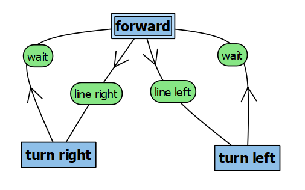
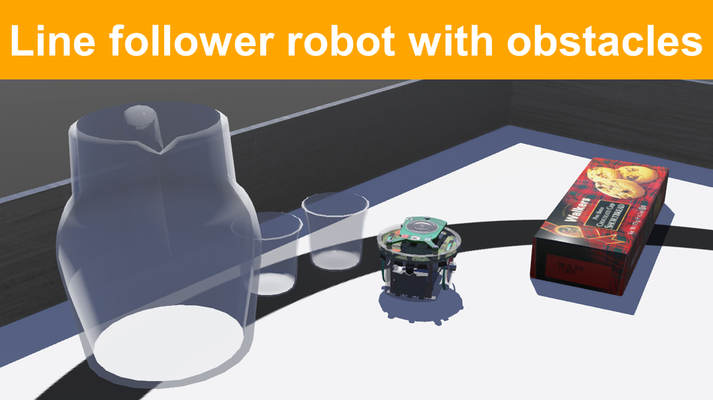

# Lab 2 – Line-follower with State Machine

## Objectives
The goal of this lab is to learn more about controllers in Webots via the implementation of state machine to make the robot follow a line. 

## Pre-requisites
* You must have Webots R2022a (or newer) properly configured to work with Python. 
* You must know how to create a robot controller in Python and how to run a simulation. 

If you are still missing any of those, please go back to [Lab 1](../Lab1/ReadMe.md) and complete the corresponding tasks.

## The e-puck robot
Webots contains a realistic model of e-puck, a small differential-drive mobile robot. The movement of this type of robot is controlled by independently adjusting the speeds of the left and right wheels. 

The e-puck robot has multiple sensors. To detect obstacles, the e-puck contains 8 infrared distance sensors around its body. Optionally, 3 infrared sensors can be mounted under its base, pointing to the floor, allowing the implementation of a line-following behavior. 

An explanation about the e-puck robot and how to use it in Webots is available in Webots Tutorial 4.

## Tasks

1- **Follow [Webots Tutorial 4](https://cyberbotics.com/doc/guide/tutorial-4-more-about-controllers?tab-language=python)** to better understand the e-puck model and learn how to control it in Python.

2- After finishing tutorial 4, **open the line-following sample world**: Click on `File > Open Sample Worlds` and go to `robots > gctronic > e-puck` and select `e-puck_botstudio_with_floor_sensors.wbt`. You should see a world similar to the one shown in Figure 1. _In the next steps you **must** use the e-puck robot that is loaded with this sample world because it has the floor sensors to detect the line._ 


###### Figure 1. Webots screenshot with the world “e-puck_botstudio_with_floor_sensors.wbt”.

3- You will need to make changes to the file, so you have to **save the sample world with a different name** on a folder of your choice. 

4- Write a simple program to **investigate the values returned by the floor sensors** when the robot is over the white floor and over the black line. You can use the print function to show the sensor values in the Webots console. _More information about how to read the ground sensors is given below._

5- **Test the motor speeds** to determine how fast the robot should run and turn in order to follow the line.

6- **Create a new controller in Python and implement a line-following behavior** using what you learned from the steps above. You can use the state machine shown in Figure 2 as reference. 

7- Finally, **add one extra state to stop the robot when no line is detected**.
 

###### Figure 2. A state machine diagram that implements a line-follower behavior.


## Ground sensors
In Tutorial 4 you made use of the distance sensors around the robot. To detect the line on the floor you need to use the ground sensors, instead. The simulator also treats the ground sensors as distance sensors because they are of the same type (infrared sensors). In Python you can access the ground sensors as shown below.

To initialize the ground sensors:
```
gs = []
gsNames = ['gs0', 'gs1', 'gs2']
for i in range(3):
    gs.append(robot.getDevice(gsNames[i]))
    gs[i].enable(timestep)
```

To read the ground sensors inside the main loop:
```
gsValues = []
for i in range(3):
    gsValues.append(gs[i].getValue())
``` 

To read sensor values inside the main loop:
```
line_right = gsValues[0]
line_center = gsValues[1]
line_left = gsValues[2]
```

If you need inspiration, check the [template code available here!](../Lab2/line_following_template.py)

## Solution
Try to implement the state machine yourself before checking the solution! A possible solution (without the stop state) is available [here](../Lab2/line_following_behavior.py).

The video below shows the solution code in action:

[](https://youtu.be/nW06dLEe-AU).

## Challenge: Obstacle Avoidance
Change the state machine to make e-puck **avoid obstacles** placed on its way. You can choose the type of obstacle to add: different formats might require different strategies of obstacle avoidance. Obstacles with round or rectangular shape usually are the less demanding, while obstacles with U-shape require more complex strategies.

An illustration of obstacle avoidance with state machine is given in Figure 3. Note that the obstacle avoidance strategy that was implemented required four extra states, some executing the same action as others. The animation in Figure 3 shows the active state (in red) for each condition during the simulation.


###### Figure 3. Illustration of obstacle avoidance strategy added to the existing line-follower state machine.

Student Wilfred van Reenen made the video below to illustrate the excellent performance of his obstacle avoidance state machine. If you want to go above and beyond, try to get your robot to avoid all those obstacles!

[](https://youtu.be/eELnG58BYzg).

## Conclusion
After following this lab you should know more about the e-puck robot model, how to program a controller for it in Python, and how to program a robot behavior based on state machine. 

## Next Lab
Go to [Lab 3](../Lab3/ReadMe.md) - Odometry-based Localization

Back to [main page](../README.md).
