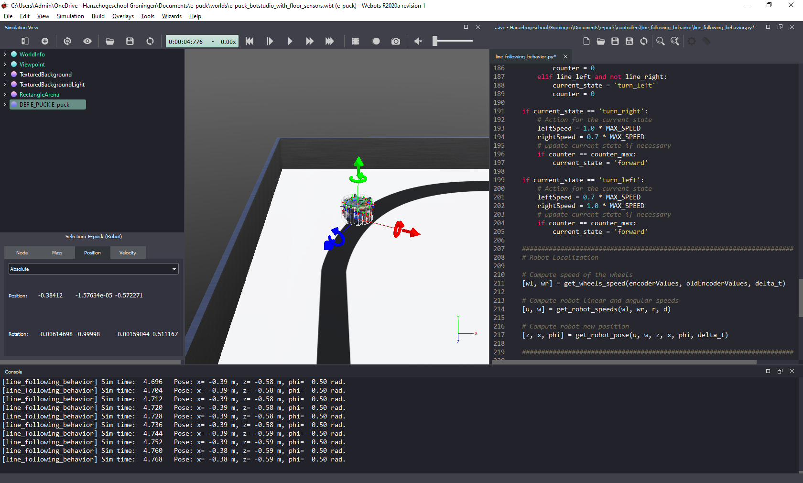

# Lab 3 – Odometry-based Localization

## Objective
The goal of this lab is to implement a simple algorithm for odometry-based robot localization and evaluate its accuracy.

## Robot Pose
To see the pose of the robot as calculated by Webots, click on “DEF E_PUCK E-puck” on the left menu and select “Position”. You will see the values of position and orientation of the robot (see Figure 1). You should print the position calculated by your functions at the end of each cycle, as shown in Figure 1, to facilitate comparison with the pose as calculated by Webots.



Figure 1. Webots screenshot showing robot pose calculated by the simulator (left) and by the Python code (bottom).

## Webots Reference Frame
In Webots, the robot moves in the XZ plane! Figure 2 shows the orientation of the reference frames adopted in most cases (on the left) and in Webots (on the right). 

 

Figure 2. Orientation of the reference frames used to develop our controller equations (left) and adopted by Webots (right).

## Taks
Your main task is to write code to implement the functions below to add localization capability to your line-following behavior. In the main loop of your program, those functions should be called in a sequence:
```
    # Compute speed of the wheels
    [wl, wr] = get_wheels_speed(encoderValues, oldEncoderValues, delta_t)
    
    # Compute robot linear and angular speeds
    [u, w] = get_robot_speeds(wl, wr, r, d)
    
    # Compute new robot pose
    [z, x, phi] = get_robot_pose(u, w, z, x, phi, delta_t)
```
I recommend you try to modify your line following code from Lab 2 to implement the localization as described above. Try doing it yourself, first. If your code is not working, or you need inspiration, you can use the [provided template](../Lab3/lab3_template.py). 

The tasks are listed below:

1. Write the function `get_wheels_speed(encoderValues, oldEncoderValues, delta_t)` to calculate the speed of the robot wheels based on encoder readings. Test your code before moving to the next step.
2. Write the function `get_robot_speeds(wl, wr, r, d)` to calculate the linear and angular speeds of the robot based on the speed of its wheels. Test your code before moving to the next step.
3. Write the function `get_robot_pose(u, w, z, x, phi, delta_t)` to calculate the position and orientation of the robot based on its orientation and linear and angular speeds.
4. Compare the pose calculated by your functions with the pose calculated by Webots in different moments of the simulation. 

### Think about the following questions

* How accurate is the odometry-based localization?
* In what conditions is odometry-based localication useful? And when is it problematic?

### Some information for implementing the code
The definition of the variables used in the functions is given below.

```
Robot pose and speed in (x,z) coordinates:
x = position in x [m]
z = position in z [m]
phi = orientation [rad]
dx = speed in x [m/s]
dz = speed in z [m/s]
dphi = orientation speed [rad/s]

Robot wheel speeds:
wl = angular speed of the left wheel [rad/s]
wr = angular speed of the right wheel [rad/s]

Robot linear and angular speeds:
u = linear speed [m/s]
w = angular speed [rad/s]

Period of the cycle:
delta_t = time step [s]
```

To calculate robot localization you will need to use some physical parameters of the robot:

```
r = radius of the wheels [m]: 20.5mm 
d = distance between the wheels [m]: 52mm 
```

You can use the pieces of code below to initialize the encoder sensors and to read encoder values in the main loop of your program:

To initialize encoders:
```
encoder = []
encoderNames = ['left wheel sensor', 'right wheel sensor']
for i in range(2):
    encoder.append(robot.getPositionSensor(encoderNames[i]))
    encoder[i].enable(timestep)
```

To read the encoders in the main loop:
```
    encoderValues = []
    for i in range(2):
        encoderValues.append(encoder[i].getValue())    # [rad]
```
The encoder values are incremented when the corresponding wheel moves forwards and decremented when it moves backwards.

## Conclusion
After following this lab you should know more about the implementation and limitations of odometry-based localization for mobile robots.

## Challenge
1. Replace the line-following state-machine by a "go-to-goal" controller using a PID. Test it by making the robot go to the 4 corners of the field, and then to the center.
2. Add a [compass sensor](https://cyberbotics.com/doc/reference/compass?tab-language=python) to your robot and use its value to calculate the robot orientation (instead of odometry). Is there an improvement in pose accuracy? 

## Super challenge
Implement a 1-D Kalman Filter to combine the values given by the compass with the orientation calculated via odometry to get a better estimate of the robot orientation. In [this post](https://medium.com/analytics-vidhya/kalman-filters-a-step-by-step-implementation-guide-in-python-91e7e123b968) you find explanation about the Kalman Filter and how to implement it in Python. 

## Solution
Try to implement the localization code yourself before checking the solution! After a successfull implementation, or if you need more inspiration than the template, an example code is available [here](../Lab3/line_following_with_localization.py).

## Next Lab
Go to [Lab 4](../Lab4/ReadMe.md) - Trajectory Tracking Controller

Back to [main page](../README.md).
