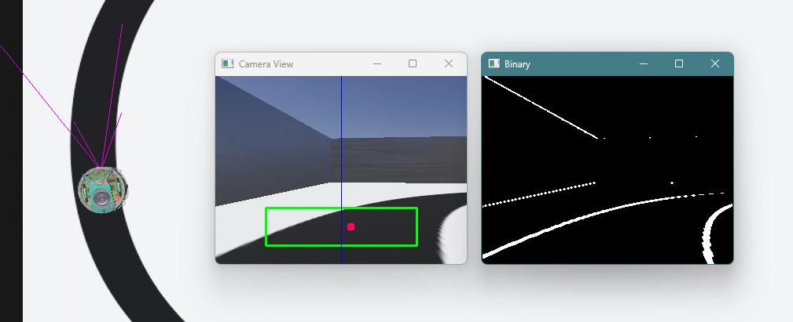
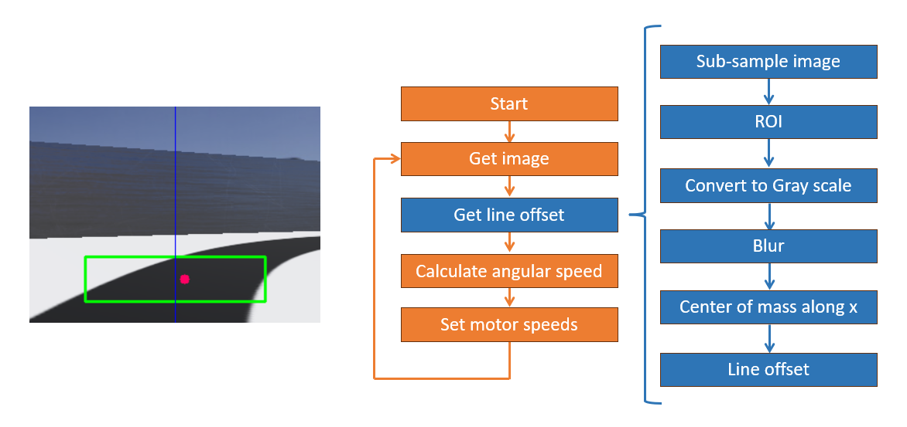
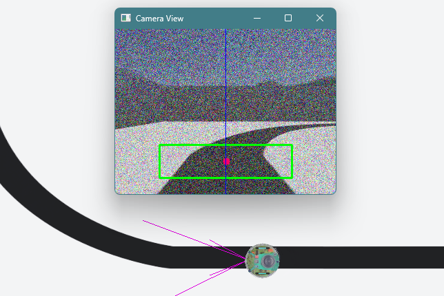

# Lab 3 – Vision-based Line-following Behavior

## Objectives
In this lab you will implement another line-following behavior, but now using images from the robot's camera as input, instead of its ground sensors. The goal is to understand the basic steps to process images and acquire relevant information to control the robot.

## Pre-requisites
* You must have Webots R2022a (or newer) properly configured to work with Python. 
* You must know how to create a robot controller in Python and how to run a simulation. 
* You should have a working solution of [Lab 2](../Lab2/ReadMe.md).  

If you are still missing any of those, please go back to previous labs and complete the corresponding tasks.

## The e-puck robot camera
The [e-puck model in Webots](https://www.cyberbotics.com/doc/guide/epuck?version=R2021a) contains a camera that generates images from the environment that can be processed and used in our code. It is a color camera with a maximum resolution of 640x480 pixels.

Figure 1 shows a screenshot of the e-puck robot following a line using a vision-based controller. The pink lines in front of the robot indicate the view frustum (the camera's field of view - what objects are visible). The two windows next to the robot show: 

1. The _Camera View_ window shows the environment as seen by the robot's camera. On top of the original image, we are drawing the Region-of-Interest - **ROI** (green box), the center of the image (blue line) and the desired position of the robot (red dot).
2. The _Binary_ window shows a processed version of the same image, emphasizing its verical edges.

In this lab, you will understand how this is done and how to use it to control the robot. 

###### Figure 1. Webots screenshot with the e-puck robot following the line using a vision-based controller. 

------------ Estou aqui ----------------

## Image Processing

###### Figure 2. Flowchart of the vision-based line-following controller. 

## Tasks

An implementation is available [here](../Lab3/line_following_with_camera.py).

bla bla bla

------------ Daqui pra frente está pronto. ------

By default, Webots models a perfect camera (no noise and no motion blur). Because the line is black and thick, and the floor is white, there is sufficient contrast and smooth change when the robot is following the line. So, in our case, the performance does not suffer much from motion blur. 

In contrast, camera noise does have a strong influence in the quality of the captured image. Figure 3 illustrates how the image from the camera is compromised when the noise level is set to 0.5. The degradation in image quality can impact the performance of the system.

###### Figure 3. Resulting image when camera noise is set to 0.5. 

Now you are going to investigate how camera noise affects the performance of the two functions used in line-following controller example code: 

- Click the e-puck robot, select "camera_noise" and increase its value. 
- Run the code to check if the robot is still able to follow the line. If not, reduce its value. _Noise values do not have to be integer numbers._  
- Check how the image generated by the camera and the images processed by the code is affected by the changing values of noise. 
- Repeate the steps above to check the performance of both `detect_line_position(image)` and `detect_line_position_2(image)` functions. 
- What are the maximum values of camera noise that each of the functions can support? Can you explain why the values are different (or the same, whichever is the case)?

## Challenge
Set camera noise to a value above which the robot no longer follows the line. Make changes in the code to improve the performance of the line detection so that the robot is able to follow the line with higher values of noise. 

## Solution
No solution is available for the challenge. Tips:
- Think about what you need to change to improve noise reduction in the image. 
- Look at the images from the camera to check if the generated offset makes sense. Can you change something in the controller?
- Not necessarily the same changes will solve the problem in both `detect_line_position(image)` and `detect_line_position_2(image)` functions.

## Conclusion
After completing this lab you have a better understanding of how to process images from a camera to obtain information for robot navigation.

## Next Lab
In the next lab we will use encoder values to estimate the position and orientation of the robot while it navigates. 

Go to [Lab 4](../Lab4/ReadMe.md) - Odometry-based Localization

Back to [main page](../README.md).
