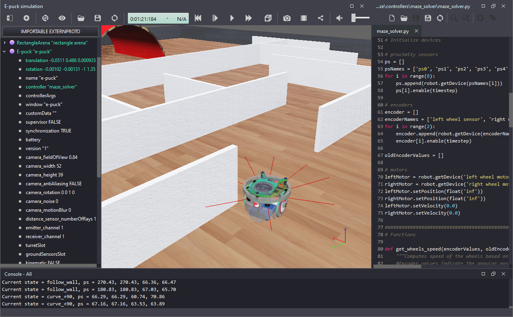

# Lab 4 – Trajectory Tracking Controller

## Objective
The goal of this lab is to implement a controller that enables the robot to follow a trajectory. The same controller can be used as a "go-to-position" controller. 



Figure 1. Webots screenshot - at the console (bottom) you see reference values of linear speed _u_ref_ and angular speed _w_ref_ generated by the trajectory tracking controller.

## Tasks
Your main task is to write code to implement the functions below to add the controller to your line-following behavior from Lab 3. In the main loop of your program, those functions should be called in a sequence:

```
# Trajectory tracking controller
[u_ref, w_ref] = traj_tracking_controller(dzd, dxd, zd, xd, z, x, phi, a)

# Convert reference speeds to wheel speed commands
[leftSpeed, rightSpeed] = wheel_speed_commands(u_ref, w_ref, d, r)
```

The variable _a_ contains the distance [m] between the point whose position is being controlled and the center point between the wheels. The value of _a_ can be arbitrary. The smaller the value of _a_, the closer to the center the controlled point is. But, _a_ **cannot** be equal to zero. Very small values can cause accuracy problems due to rounding errors. Recommended values are 'a = 0.05' or 'a = 0.1'. The other variables used in the functions above were defined in [Lab 3](../Lab3). 

Explanation about the trajectory tracking controller can be bound in section 4 of [[1](https://www.intechopen.com/books/applications-of-mobile-robots/motion-control-and-velocity-based-dynamic-compensation-for-mobile-robots)]. The controller equation to be implemented here is equation (20). This controller was first proposed in [[2]](https://www.sciencedirect.com/science/article/abs/pii/S0967066108000373?via%3Dihub), where more details about its stability are given. See references at the bottom of this page. 

I recommend you try to modify your code from Lab 3 to implement the controller as described above. Try doing it yourself, first. If your code is not working, or you need inspiration, you can use the [provided template](../Lab4/lab4_template.py). 

The tasks are listed below:

1. Write the function `traj_tracking_controller(dzd, dxd, zd, xd, z, x, phi, a)` to calculate reference values of linear and angular velocities. Those values should later be used to calculate the reference speeds of each wheel. Test your code before moving to the next step.
2. Write the function `wheel_speed_commands(u_ref, w_ref, d, r)` to calculate the reference speeds for the left and right wheels. Those are the values that need to be sent to the wheel controllers for the robot to follow the desired trajectory.
3. Test the trajectory tracking controller using the desired values below. You might need to adjust the controller gains.
```
xd = 0.0	# desired position x [m]
zd = 0.0	# desired position z [m]
dxd = 0.0	# desired speed in x [m/s]
dzd = 0.0	# desired speed in z [m/s]
```
4. Test different values of desired positions xd, zd and verify if the robot behaves as expected. If you keep the desired speeds as zero, changing the values of xd and zd should make the controller behave as a `go-to-position` controller. 


## Other details

As mentioned in Lab 3, remember that in Webots the robot moves in the XZ plane! Figure 2 shows the orientation of the reference frames adopted in most cases (on the left) and in Webots (on the right). 

 

Figure 2. Orientation of the reference frames used to develop our controller equations (left) and adopted by Webots (right).

Position (x=0, z=0) is in the center of the track. To facilitate the comparison with the speeds calculated by Webots, print the values calculated by your functions, as shown in Figure 3. 


Figure 3. Webots screenshot showing robot pose calculated by the simulator (left) and by the Python code (bottom).


### Think about the following questions

* Considering that you are using odometry-based localization, how does it affect the performance of the trajectory-tacking controller?
* What would you change in the code for the controller to work as a pose controller (final position + orientation)?

## Conclusion
After following this lab you should know how to implement moving controllers for mobile robots, especially to go to position and follow a trajectory.

## Challenge
Create a function to generate a trajectory: a vector `(xd, zd, dxd, dzd)` with position and speed for all points in the path. Plot the instantaneous value of position error. Adjust the controller gains to make your robot follow this trajectory with as little error as possible. 

## Solution
Try to implement the localization code yourself before checking the solution! After a successfull implementation, or if you need more inspiration than the template, an example code is available [here](../Lab4/trajectory_tracking_controller.py).

## Next Lab
Go to [Lab 5](../Lab5/ReadMe.md) - Combine Behaviors to Execute a Complex Task

Back to [main page](../README.md).

## References
[[1] Martins, Felipe Nascimento, and Alexandre Santos Brandão. "Motion control and velocity-based dynamic compensation for mobile robots." Applications of mobile robots (2018).](https://www.intechopen.com/books/applications-of-mobile-robots/motion-control-and-velocity-based-dynamic-compensation-for-mobile-robots)

[[2] Martins, F. N., Celeste, W. C., Carelli, R., Sarcinelli-Filho, M., & Bastos-Filho, T. F. (2008). An adaptive dynamic controller for autonomous mobile robot trajectory tracking. Control Engineering Practice, 16(11), 1354-1363.](https://www.sciencedirect.com/science/article/abs/pii/S0967066108000373?via%3Dihub)


