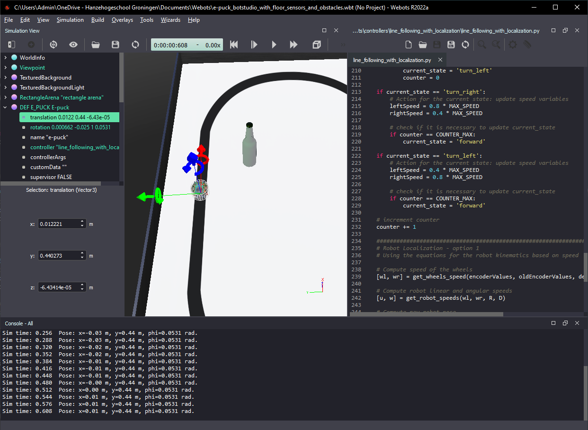

# Lab 4 – Odometry-based Localization

## Objective
Localization is the process used by a mobile robot to estimate its own pose. In ground mobile robots, odometry from wheel encoders is commonly used to implement _dead reckoning_, a navigation technique used to estimate the current position of a moving object by using a previously determined position. We refer to such implementation as **odometry-based localization**. The goal of this lab is to implement a simple algorithm for odometry-based robot localization and evaluate its accuracy.

## Pre-requisites
* You must have Webots R2022a (or newer) properly configured to work with Python (see [Lab 1](../Lab1/ReadMe.md)).
* You must know how to create a robot controller in Python and how to run a simulation (see [Lab 1](../Lab1/ReadMe.md)). 
* You must have a working solution of [Lab 2](../Lab2/ReadMe.md).  
* You must understand how to implement [odometry-based Localization](https://github.com/felipenmartins/Mobile-Robot-Control/blob/main/odometry-based_localization.ipynb) for the differential-drive robot.

If necessary, please go back to previous labs to complete the corresponding tasks, or go to the Jupyter Notebook linked above.

## Mobile Robot Pose
The pose of a mobile robot in 3D space is defined by a minimum of 6 values (we say it's 6 Degrees of Freedom - DoF). A common representation uses 3 values to define its position along the axes `(x, y, z)`, and 3 values to define its orientation using Euler angles:

- Roll `(φ)`: rotation around the x-axis (tilting sideways)
- Pitch `(θ)`: rotation around the y-axis (tilting forward/backward)
- Yaw `(ψ)`: rotation around the z-axis (turning left/right)

So, the full pose in 3D is a vector `(x, y, z, φ, θ, ψ)`.

_Note_: Besides Euler angles, there are many other representations for orientation, like rotation matrix, quaternion, or axis-angle. For more information, refer to [Rotation representation](https://dgbshien.com/docs/blogs/rotation-representation.pdf), by 
Bang-Shien Chen.

For ground robots (like the e-puck), **pose is often represented as `(x, y, ψ)`**: position on the floor plane with coordinates `(x, y)`, and orientation given by the yaw angle `ψ`. This considers that roll, pitch, and `z` are zero (i.e., the robot is not flying nor rolling over).

To see the "real" pose of the robot given by Webots, click on “DEF E_PUCK E-puck” on the left menu and select _translation_. You will see the values of position `(x, y, z)` of the robot as shown in Figure 1. 



###### Figure 1. Webots screenshot showing robot pose calculated by the simulator (left) and by the Python code (bottom).

In the same menu, f you select _rotation_ you will see values that represent the robot orientation in 3D space. By default, Webots represents orientation using **axis-angle** format, which uses 4 values: `(x_a, y_a, z_a, θ_a)`. In this case, the first 3 values  `(x_a, y_a, z_a)` define the _axis of rotation_ as a unit vector, and the last value `θ_a` gives the _angle of rotation around that axis_, in radians. Assuming the robot only moves on the floor plane and does not roll over, Webots will often represent its orientation as `(0, 0, 1, θ_a)`, which means a rotation of `θ_a` radians around the `z` axis. In other words, **the value `θ_a` is equal to the robot's orientation in the floor plane `ψ`**.

In ideal conditions, for robots navigating on the floor plane the axis of rotation `(x_a, y_a, z_a)` would always be `(0, 0, 1)`, which is perfectly aligned with the `z` axis. However, the axis of rotation calculated by Webots varies slightly as the robot moves, resulting in values of `x_a` and `y_a` close (but not exactly equal) to zero, and values of `z_a` that are close (but not exactly equal) to one. To keep it simple, we can assume that the rotation vector is always aligned with the `z` axis, meaning that `θ_a` can be considered equal to the robot's orientation  `ψ`. Mind the sign of `z_a`: when negative, this means that the axis of rotation is pointing in the opposite direction, which means that `θ_a = -ψ`.

## Tasks
Your main task is to write code to implement the functions below to add localization capability to your line-following behavior. The functions below should be called in sequence in the main loop of your program:
```
# Compute speed of the wheels
[wl, wr] = get_wheels_speed(encoderValues, oldEncoderValues, delta_t)
    
# Compute robot linear and angular speeds
[u, w] = get_robot_speeds(wl, wr, R, D)
    
# Compute new robot pose
[x, y, phi] = get_robot_pose(u, w, x, y, phi, delta_t)
```

The tasks are listed below:

1. **Write the function `get_wheels_speed(encoderValues, oldEncoderValues, delta_t)`** to calculate the speed of the robot wheels based on encoder readings. Test your code before moving to the next step.
2. **Write the function `get_robot_speeds(wl, wr, R, D)`** to calculate the linear and angular speeds of the robot based on the speed of its wheels. Test your code before moving to the next step.
3. **Write the function `get_robot_pose(u, w, x, y, phi, delta_t)`** to calculate the position and orientation of the robot based on its orientation and linear and angular speeds.
4. **Compare the pose calculated by your functions with the pose calculated by Webots** in different moments of the simulation. 

In your main loop, print the pose calculated by your functions at the end of each cycle, as shown in Figure 1, to facilitate comparison with the pose as given by Webots.

### Some information for implementing the code
The definition of the variables used in the functions is given below.

* Robot pose and speed in (x,y) coordinates:
  - `x` = position in x [m]
  - `y` = position in y [m]
  - `phi` = orientation [rad]
  - `dx` = speed in x [m/s]
  - `dy` = speed in y [m/s]
  - `dphi` = orientation speed [rad/s]

* Robot wheel speeds:
  - `wl` = angular speed of the left wheel [rad/s]
  - `wr` = angular speed of the right wheel [rad/s]

* Robot linear and angular speeds:
  - `u` = linear speed [m/s]
  - `w` = angular speed [rad/s]

* Period of the cycle:
  - `delta_t` = time step [s]


To calculate robot localization you will need to use some physical parameters of the robot:

  - `R` = radius of the wheels [m]: 20.5mm 
  - `D` = distance between the wheels [m]: 52mm 


As discussed in Lab 2, encoders need to be initialized before they can be used in the simulation.

To initialize encoders:
```
encoder = []
encoderNames = ['left wheel sensor', 'right wheel sensor']
for i in range(2):
    encoder.append(robot.getDevice(encoderNames[i]))
    encoder[i].enable(timestep)
```

To read the encoders in the main loop:
```
encoderValues = []
for i in range(2):
    encoderValues.append(encoder[i].getValue())    # [rad]
```
The encoder values are incremented when the corresponding wheel moves forwards and decremented when it moves backwards. You can use the `test_sensors.py` controller from Lab 2 to check how encoder values change as the robot moves. 

### Think about the following questions

* How accurate is the odometry-based localization?
* In what cases is odometry-based localication useful? And when is it problematic?

## About localization error
The algorithm for odometry-based localization presented in the Jupyter Notebook linked above applies the [Euler method](https://en.wikipedia.org/wiki/Euler_method), which is a first-order method for numerical integration of differential equations. This is probably the simplest way to implement numerical integration, but the resulting value contains an error proportional to the step size (`delta_t`). 

In my simulations, with a time step of 32 ms, the pose estimation would quickly diverge from the "true" robot pose indicated by Webots after only a few seconds of simulated time. I had to reduce the time step to 4 ms to get an acceptable level of error for about one minute of simulated time. You can adjust the time step by changing the value of the variable "basicTimeStep" of "WorldInfo", on the left menu. 

Note that the error also depends on the path followed by the robot, but the above comparison serves to illustrate how much the time step influences the pose estimation error.  

_Tip: Reducing the time step increases computational demand, which results in slower simulations. You can increase simulation speed by reducing the number of "FPS" to a minimum._

## Solution
A partial solution is provided for this lab. First, try to modify your line following code from Labs 2 or 3 to implement the localization as described above. If you need inspiration, you can use the [provided template](../Lab4/lab4_template.py). 

If you need extra explanation, check the Jupyter Notebook for [Odometry-based Localization](https://github.com/felipenmartins/Mobile-Robot-Control/blob/main/odometry-based_localization.ipynb).


## Challenge
There are many ways to improve the performance of robot localization. A "simple" way would be to use external systems like GPS (or equivalent), which give very accurate position estimates without drift. However, GPS does not work well (or at all) in indoor environments like tunnels, undergound garages, mines, under water etc., and is not controlled by the robot. Another "simple" solution is to use more sensors to gather more informantion about the movement of the robot with respect to its environment. 

In this challenge, you are going investigate two ways of reducing pose estimate error using only internal sensors of the robot. 

First, because the environment is known, you can use information about it to help with the robot localization. For instance, when the robot is following the line, it can only be located in a position along the line, and not anywhere else. Use the robot's ground sensors to constrain the estimated position to values that are on top of the line when the robot is following it. This helps reducing the drift problem of odometry-based localization.

Then, investigate how to use other sensors (like a compass or gyroscope) to estimate the robot's orientation. Finally, Implement a 1-D Kalman Filter to combine the values given by this extra sensor with the orientation calculated via odometry to get a better estimate of the robot orientation. In [this post](https://medium.com/analytics-vidhya/kalman-filters-a-step-by-step-implementation-guide-in-python-91e7e123b968) you find explanation about the 1-D Kalman Filter and how to implement it in Python. 


## Conclusion
After following this lab you should know more about the implementation and limitations of odometry-based localization for mobile robots.

## Next Lab
In the next lab you will use the estimated robot pose to implement a go-to-goal behavior based on a PID controller. 

Go to [Lab 5](../Lab5/ReadMe.md) - Go-to-goal behavior with PID

Back to [main page](../README.md).
