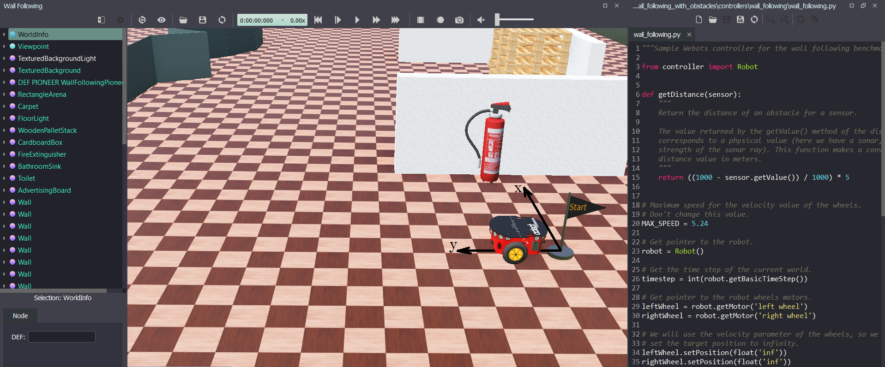
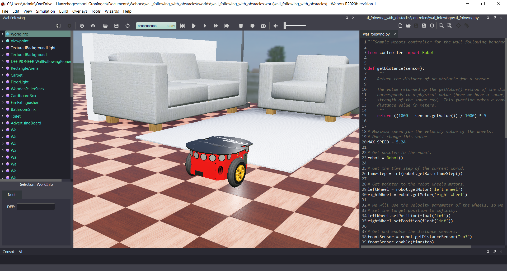

# Lab 5 - Combine Behaviors to Execute a Task

## Objectives
The goal of this lab is to combine different behaviors to make your robot execute a complex task. You will also investigate and learn about another mobile robot widely used in research: Adept's Pioneer 3-DX.

## Before you start
Download the file [wall_following_with_obstacles.zip](wall_following_with_obstacles.zip) and unzip it in a folder of your preference. After unzipping the file, open the world `...\wall_following_with_obstacles\worlds\wall_following_with_obstacles.wbt`. You should see a Pioneer robot at the start position, as shown in Figure 1.

Figure 1. Screenshot showing the Pioneer 3-DX robot at the starting position of the world.

One important thing to note is that the configuration of the central wall changes every time you load or reset the world.

The provided world is based on a sample world from Webots, called wall_following. The main difference is that the provided world was populated with obstacles, as shown in Figure 2. The original sample world is available at `robotbenchmark -> wall_following -> wall_following.wbt`.

Figure 2. Some obstacles included in the provided world.

## Tasks
Follow the steps below to successfuly complete this lab.

1. Learn about the Pioneer 3-DX robot. Investigate the characteristics of the robot: its type, available sensors, actuators, maximum speed, etc. Investigate the functions used in Python to control the robot and how the robot XYZ reference frame is oriented with respect to the world. In [this link](https://cyberbotics.com/doc/guide/pioneer-3dx) you find a lot of information about it, including how its model is simultated on Webots.

2. Implement 3 behaviors (task controllers) in Python: wall-following, trajectory tracking and obstacle avoidance. 

3. Implement a finite state machine (also in Python) to control the execution of the mission described below.

### Description on the behaviors
1.	**Wall-following**: adjust the example program so that the robot successfully follows the central wall while keeping it on its right side. In other words, the robot should follow the central wall in the opposite direction from the example program. You might need to adjust the PID gains.  The example program with a wall-following behavior can be found in the folder `...\wall_following_with_obstacles\controllers`.
2.	**Trajectory tracking**: implement the trajectory tracking controller as described in Lab 4. The controller must include the saturation terms to avoid the generation of very high reference speeds when the error is too big. The maximum reference speeds must be equal or lower than the maximum speeds achieved by the robot.
3.	**Obstacle avoidance**: develop and implement an obstacle avoidance behavior so that the robot avoids obstacles without touching them. 

### Description of the mission
- The initial position of the robot is (0, 0) m. 
- The robot must move straight towards the central wall until its distance to it is 0.5m.
- Then, the robot must follow the wall while keeping it on its right side until it gets to position (??, 20.0) m. 
- After getting to the above position, the robot must make a full turn around its own center (360 degrees).
- Then, it should execute trajectory tracking + obstacle avoidance behaviors to go back to its original position. 

## Conclusion
After completing this lab you are able to combine many behaviors for a mobile robot to execute a complex mission. Keep in mind that this is a challenging exercise! Don't be disappointed if you don't complete this lab in full.

A solution is not provided for this lab. If you want to contribute with your solution, feel free to create a pull request! :-)

## Next Lab (bonus)
Go to [Lab 6](../Lab6/ReadMe.md) - Robot Soccer Team

Back to [main page](../README.md).
