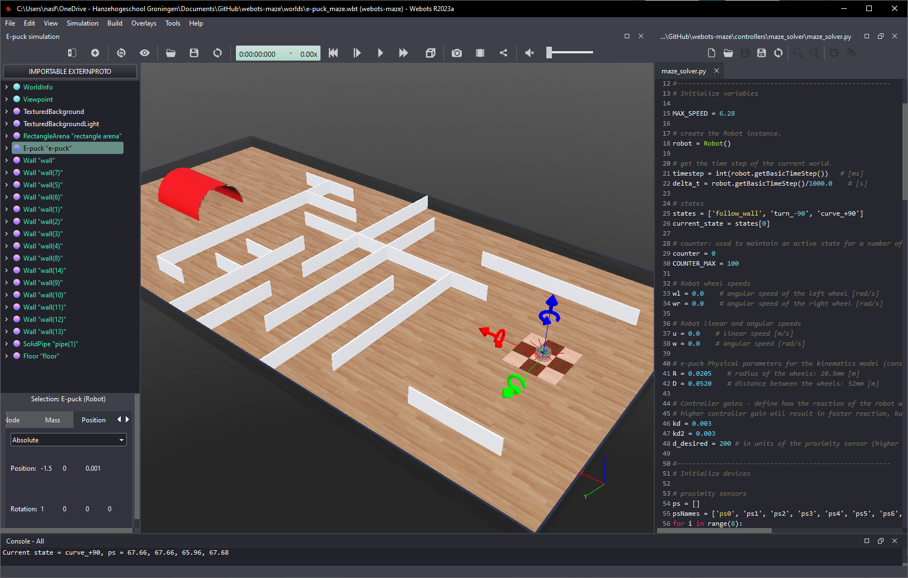
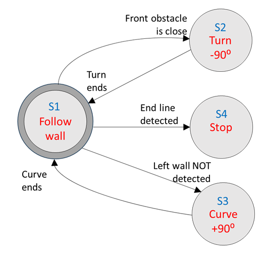

# Lab 5 - Combine Behaviors to Complete a Mission

## Objectives
The main goal of this lab is to combine different behaviors to make your robot perform a complex mission. You will implement a state machine and simple behaviors (like wall-following, go-to-goal with PID etc.) for the robot to navigate through a maze while tracking its pose.

## Pre-requisites
* You must have Webots R2023a (or newer) properly configured to work with Python (see [Lab 1](../Lab1/ReadMe.md)).
* You must know how to create a robot controller in Python and how to run a simulation (see [Lab 1](../Lab1/ReadMe.md)). 
* You must know how to [implement simple behaviors](https://github.com/felipenmartins/Mobile-Robot-Control/blob/main/robot_behaviors.ipynb), a [state machine](../Lab2/ReadMe.md), a [localization algorithm](../Lab3/ReadMe.md) and a controller for robot navigation (either [PID](../Lab4/ReadMe.md) or [trajectory tracking](../Lab6/ReadMe.md)). 
* Download the file [webots-maze.zip](../Lab5/webots-maze.zip) and unzip it in a folder of your preference. After unzipping the file, open the world `...\webots-maze\worlds\e-puck_maze.wbt`. You should see an environment similar to the one shown in Figure 1.

###### Figure 1. Screenshot showing the maze environment. The e-puck robot starts at the center of the checker texture square (right) and must navigate to the red tunnel (left).

## Description of the Mission
**The mission of your robot is to pass under the red tunnel**. The e-puck robot starts at the center of the checker texture square (right) and must navigate through the maze to get to the red tunnel (left). The robot can follow any free path (it does not need to be the shortest nor the fastest).

### Requirements
There are many ways to implement a program for the robot to complete this mission. But for this  assignment you **must** implement concepts from other labs. The list of requirements is given below:

- The provided **environment cannot be changed**: no object can be added, moved or removed from the provided world.
- **Odometry-based localization** algorithm must be implemented to keep track of the robot pose. As it navigates, its position and orientation must be printed to the console;
- **Go-to-goal controller with PID** _or_ **trajectory tracking controller** must be implemented to move the robot when not close to walls. The controller **must** generate reference values for **linear and angular velocities**.
- **Wall-following** _or_ **corridor-following** behavior must be implemented to move the robot when inside the maze. The behavior **must** generate reference values for **linear and angular velocities**.
- A **state machine** must be implemented to select the behaviors and controllers to complete the mission. The active state must be printed to the console.
- Images from the robot **camera** must be used to localize the red tunel.
- _For maximum points_: instead of proximity sensors, use images from the robot **camera for navigation** inside the maze.

Figure 2 illustrates the e-puck robot navigating through the maze by switching between three different behaviors: `wall-following`, `curve +90 deg` and `turn -90 deg`. 

###### Figure 2. Maze navigation by switching between three simple behaviors: wall-following, curve +90 degrees and turn -90 degrees.

The selection of the active behavior is done by the state machine diagram shown in Figure 3, which uses the proximity sensor readings for transitions between states. Images from the robot camera can be processed to identify the events that cause the transitions shown in the diagram, allowing for the use of the same state-machine.

###### Figure 3. Maze-solver state machine diagram.

## Solution
No solution is provided for this lab. A [bare-bones template](maze_solver.py) for the code is provided in the ZIP file, which can be used as a starting point for the implementation of your solution. Also check the solutions of previous labs and the [Jupyter Notebooks for Mobile Robot Control](https://github.com/felipenmartins/Mobile-Robot-Control).

## Conclusion
After completing this lab you are able to combine many behaviors for a mobile robot to execute a complex mission. 

## Next Lab
Go to [Lab 6](../Lab6/ReadMe.md) - Trajectory Tracking Controller

Back to [main page](../README.md).
