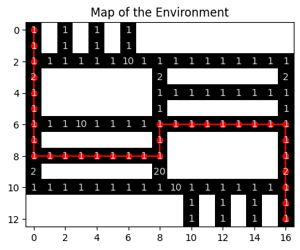
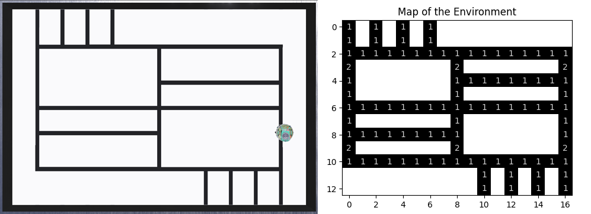
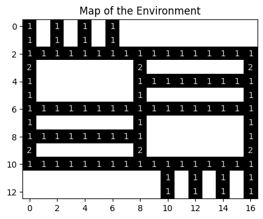
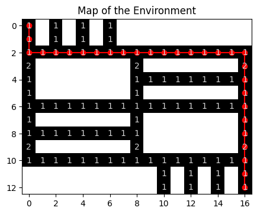

# Lab 9 – Path planning with Dijkstra

## Objective
Robot path planning finds a sequence of valid destinations (intermediate goals) to move a robot from a start point to a destination in a known environment. The goal of this lab is to apply Dijkstra's algorithm to plan a path for the e-puck robot to follow. 

<center>

</center>

###### Figure 1. Plot of a map of the environment: the map is divided into cells (grid map); black lines represent all possible paths for the robot; numbers represent the cost for the robot to cross the corresponding cell; red line shows the planned path that results in lower cost from start (0, 0) to goal (12, 16). 

## Dijkstra's Algorithm

Dijkstra's Algorithm is a graph-based path finding algorithm that **guarantees the optimal path** in a weighted graph. Such optimal path is obtained by finding the path of minimal _cost_, which can be related to different aspects, like distance, battery usage, time etc.. In the context of robotics, Dijkstra's Algorithm  is particularly useful for path planning in known environments (known map). 

In this lab, we are going to work with a **grid map**, which is a way to represent the environment as a grid of small cells, as illustrated in Figure 1. Such map represents a **graph** where each **node** corresponds to a position (a grid cell), and **edges** represent connections between cells. The **weights** represent the cost of moving from one node to another (the numbers in Figure 1, which are costs associated to the robot arriving at each cell). Dijkstra's algorithm always finds the **least-cost path from a start node to a goal node**, if it exists. Such a path is also the shortest if the costs are proportional to the distances between nodes. However, if the costs represent other aspects (like presence of obstacles, for example), then the resulting path might not be the shortest, as illustrated by Figure 1. 


## Pre-requisites
* You must have Webots R2023a (or newer) properly configured to work with Python (see [Lab 1](../Lab1/ReadMe.md)).
* You must know how to create a robot controller in Python and how to run a simulation (see [Lab 1](../Lab1/ReadMe.md)). 
* You must know how to [implement simple behaviors](https://github.com/felipenmartins/Mobile-Robot-Control/blob/main/robot_behaviors.ipynb), and a [state machine](../Lab2/ReadMe.md) to select the robot behavior. 
* You must understand how Dijkstra's Algorithm work and how to implement it in Python. A detailed explanation can be found in the Jupyter Notebook [Dijkstra's Algorithm for Robotic Path Planning](https://github.com/felipenmartins/Mobile-Robot-Control/blob/main/path_planning_dijkstra.ipynb). The notebook also shows how to define a grid environment for the robot and how you can visualize the map and generated path like in Figure 1.

## Tasks

We will start with a line-following algorithm on the same world provided in the ZIP file of Lab 8 (see above). Contrary to Lab 8, the main tasks are not going to use an external microcontroller. 

Follow the steps below to prepare your environment:

1. If you haven't done so, go back to [Lab 8](../Lab8/ReadMe.md) and follow steps 1-3 to install the world shown in Figure 1. 

2. After that, **create a new Python controller** for the robot, and **copy the code** from [`line_following_behavior.py`](../Lab2/line_following_behavior.py) to it. **Save the controller** file (use the save button on top of the code).

3. **Run the Webots simulation** and verify that the robot follows the line. The code from `line_following_behavior.py` is the solution of Lab 2, which was designed to follow a line with no intersections or sharp curves. It is expected that the robot will drift off the line at corners. 

Now, you are going to modify the given code. The approach proposed here is to create 2 new behaviors (`turn_90_deg_left` and `turn_90_deg_right`) to turn the robot left or right at crossings. Then, when the path is planned by Dijkstra, you will be able to select between `follow-line` and those new behavios and to make the robot follow the path. 

4. For the above strategy to work, your robot must be able to detect line crossings. **Create a function to detect line-crossings** while following the line. Test how the ground sensors behave when the robot is at crossings to define this function. 

5. **Create the new behaviors** `turn_90_deg_left` (to turn the robot 90 degrees to the left) and `turn_90_deg_right` (to turn it to the right). Both must turn the robot while _not_ moving forwards. 

6. Now it's time to **implement Dijkstra's algorithm**. The first thing you need is a map of the environment. We chose to represent the map as a 2D array of size 13 x 17 where `0` represents free space for the robot to navigate and `1` represents obstacles that block the robot's movement:

```
    grid = np.array([
        [0, 1, 0, 1, 0, 1, 0, 1, 1, 1, 1, 1, 1, 1, 1, 1, 1],
        [0, 1, 0, 1, 0, 1, 0, 1, 1, 1, 1, 1, 1, 1, 1, 1, 1],
        [0, 0, 0, 0, 0, 0, 0, 0, 0, 0, 0, 0, 0, 0, 0, 0, 0],
        [0, 1, 1, 1, 1, 1, 1, 1, 0, 1, 1, 1, 1, 1, 1, 1, 0],
        [0, 1, 1, 1, 1, 1, 1, 1, 0, 0, 0, 0, 0, 0, 0, 0, 0],
        [0, 1, 1, 1, 1, 1, 1, 1, 0, 1, 1, 1, 1, 1, 1, 1, 0],
        [0, 0, 0, 0, 0, 0, 0, 0, 0, 0, 0, 0, 0, 0, 0, 0, 0],
        [0, 1, 1, 1, 1, 1, 1, 1, 0, 1, 1, 1, 1, 1, 1, 1, 0],
        [0, 0, 0, 0, 0, 0, 0, 0, 0, 1, 1, 1, 1, 1, 1, 1, 0],
        [0, 1, 1, 1, 1, 1, 1, 1, 0, 1, 1, 1, 1, 1, 1, 1, 0],
        [0, 0, 0, 0, 0, 0, 0, 0, 0, 0, 0, 0, 0, 0, 0, 0, 0],
        [1, 1, 1, 1, 1, 1, 1, 1, 1, 1, 0, 1, 0, 1, 0, 1, 0],
        [1, 1, 1, 1, 1, 1, 1, 1, 1, 1, 0, 1, 0, 1, 0, 1, 0]
        ])
```

Another array of same size is used to represent the cost of arriving at each cell. The `costs` array has almost all cells equal to one, except for a few cells with a cost of 2. Figure 2 shows the original environment (left) and its resulting map (right), where the cost of each cell is indicated by a number on top of the corresponding cell.

<center>
   

</center>

###### Figure 2. Original Webots environment (left) and its map (right). The map is made by a 10x10 grid of cells. Black lines represent all possible paths for the robot to follow and the numbers represent the cost for the robot to cross the corresponding cell. 

It is important to notice that the map does not need to have the exact proportions of the original environment. In fact, it doesn't even need to be of similar shape. For instance, we could have represented the world as a graph with line-crossings as nodes (instead of each cell), and the costs between nodes proportional to the distance between them. However, we chose for a grip map in which each cell is a node because it facilitates visualization.

7. Now, **test your implementation of Dijkstra**: select the start node as `(0, 0)` and the goal node as `(12, 16)`. After running Dijkstra with the map and costs defined above, the resulting path should be: 

```
Shortest Path: [(0, 0), (1, 0), (2, 0), (2, 1), (2, 2), (2, 3), (2, 4), (2, 5), (2, 6), (2, 7), (2, 8), (2, 9), (2, 10), (2, 11), (2, 12), (2, 13), (2, 14), (2, 15), (2, 16), (3, 16), (4, 16), (5, 16), (6, 16), (7, 16), (8, 16), (9, 16), (10, 16), (11, 16), (12, 16)]
```

Figure 3 illustrates the map with the above path indicated in red. You should realize that other paths of same cost are possible, but no path with lower cost exists. 

<center>

</center>

###### Figure 3. Plot of a map of the environment: the red line shows the planned path given above, which is a path of lowest cost from start (0, 0) to goal (12, 16). 

The path shown in Figure 1 was also generated for the same `start` and `goal` positions. Can you tell why that path is different from the one in Figure 3?

8. Finally, create a function to convert the planned path into a sequence of calls to the behaviors `follow-line`, `turn_90_deg_left`, and `turn_90_deg_right`. This can be implemented as a state machine in which transitions are triggered by line-crossings or ending turns, for example. The final implementation is up to you.


## Solution
No solution is provided for this lab. 

## Challenge
This challenge has two parts:

The first is to implement obstacle avoidance by automatically replanning the path when an obstacle is detected during robot navigation.

The second is to program Dijkstra's Algorithm **in the microcontroller** using MicroPython. You can use the example provided in [Lab 8](../Lab8/ReadMe.md) as a starting point.

**Important!** NumPy does not work in MicroPython. To use a 2D array in MicroPython, you can create a list of lists, where each inner list represents a row. For example, you can define a 2D array like this: 

```array = [[0 for _ in range(columns)] for _ in range(rows)]```

_Rows_ and _columns_ are the desired dimensions of the array. To access elements, use two indices: 

```value = array[1][2]  # Gets the element in the 2nd row and 3rd column```


## Conclusion
After following this lab you should know how to use Dijkstra's algorithm to plan optimal paths in known environments. By completing the challenge, you also practice how to implement the algorithm in the microcorntoller.


## Next Lab
Program robots to play soccer as a team in the next lab!

Go to [BONUS](../SoccerSim/ReadMe.md) - Robot Soccer Challenge

Back to [main page](../README.md).
