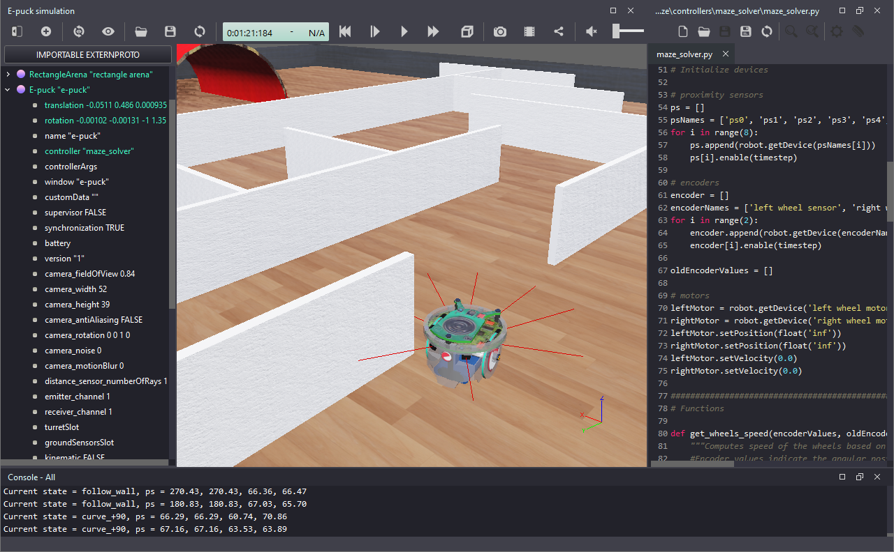

# Robotics Simulation Labs
Here you will find a set of tutorials to practice robotics concepts with [Webots Open-Source Robot Simulator](https://cyberbotics.com/) and [Python](https://www.python.org/). 

This page is available at: [https://felipenmartins.github.io/Robotics-Simulation-Labs/](https://felipenmartins.github.io/Robotics-Simulation-Labs/)

## Objectives and Content
I teach an introductory-level course on Robotics for electrical engineering students, focusing on wheeled mobile robots. These **Robotics Simulation Labs** were created to replace the practical activities of that course during the restrictions related to the COVID-19 pandemic. Initially, there were only 4 labs, but gradually more labs were added to cover more topics. Now I use the simulation labs to complement the theory and practical activities of the course, covering:

 - Webots Robot Simulator and Python
 - Programming mobile robots
 - Finite-State machines
 - Obstacle avoidance
 - Image processing for vision-based control
 - Kinematics of differential-drive robots
 - Odometry-based robot localization
 - Go-to-Goal behavior using PID controller
 - Non-linear trajectory tracking controller
 - Hardware-in-the-Loop (HIL) simulation
 - Path-planning 

Templates and solutions are presented for some labs, always in Python 3 (or MicroPython, for HIL).

## How to use
The **Robotics Simulation Labs** are presented as a series of tutorials, including references to the official Webots tutorials, when relevant. The Labs are intended to be followed in sequence, starting from the first one.

If you make use of the content in this page, please cite [[1]](https://link.springer.com/chapter/10.1007/978-3-031-21065-5_44).

Lab descriptions, templates and solutions are compatible with the global coordinate system adopted as default by Webots since version R2022a. If you use an older version of Webots, please [see this note](/coordinate_system/ReadMe.md). 

## Accompanying Jupyter Notebooks
Brief explanation of some concepts related to the labs, including how to implement them in Python, is available as [Jupyter Notebooks](https://github.com/felipenmartins/jupyter-notebooks). You can run the notebooks without the need of installing Webots. They are useful for understanding the fundamentals, especially because they allow step-by-step execution of the implemented functions. 

The available notebooks are:
- [Implementation of simple robot behaviors](https://github.com/felipenmartins/Mobile-Robot-Control/blob/main/robot_behaviors.ipynb) for mobile robot control (related to Lab 2)
- [Digital Image Processing](https://github.com/felipenmartins/Mobile-Robot-Control/blob/main/image_processing_example.ipynb) fundamentals and basic functions (related to Lab 3)
- [Odometry-based Localization](https://github.com/felipenmartins/Mobile-Robot-Control/blob/main/odometry-based_localization.ipynb) for the differential-drive robot (related to Lab 4)
- [Mobile Robot Control with PID](https://github.com/felipenmartins/Mobile-Robot-Control/blob/main/robot_control_with_PID.ipynb) for a go-to-goal moving controller (related to Lab 5)
- [Dijkstra's Algorithm](https://github.com/felipenmartins/Mobile-Robot-Control/blob/main/path_planning_dijkstra.ipynb) for Robotic Path Planning (related to Lab 7)

## Content
The content of each lab is listed below:

- [Lab 1](/Lab1/ReadMe.md) - Installation and configuration of Webots and Python
- [Lab 2](/Lab2/ReadMe.md) - Line-following Behavior with State Machine
- [Lab 3](/Lab3/ReadMe.md) - Vision-based Line-following Behavior
- [Lab 4](/Lab4/ReadMe.md) - Odometry-based Localization
- [Lab 5](/Lab5/ReadMe.md) - Go-to-goal Behavior with PID
- [Lab 6](/Lab6/ReadMe.md) - Trajectory Tracking Controller
- [Lab 7](/Lab7/ReadMe.md) - Combine Behaviors to Complete a Mission
- [Lab 8](/Lab8/README.md) - Hardware-in-the-Loop Simulation
- [BONUS](/SoccerSim/ReadMe.md) - Robot Soccer Challenge

## Simple Robot Simulator
If you are looking for a simpler simulator, try [SimRobSim](https://github.com/felipenmartins/SimRobSim), which is a simple robot simulator built using Pygame. It simulates a differential-drive robot that uses Dijkstra's algorithm to define waypoints, and implements a path-following algorithm using PID.

## Reference
If you make use of the **Robotics Simulation Labs**, please cite [[1]](https://link.springer.com/chapter/10.1007/978-3-031-21065-5_44):

[1] Lima, José, Felipe N. Martins, and Paulo Costa. "Teaching Practical Robotics During the COVID-19 Pandemic: A Case Study on Regular and Hardware-in-the-Loop Simulations." Iberian Robotics Conference. Cham: Springer International Publishing, 2022. Available at: [https://link.springer.com/chapter/10.1007/978-3-031-21065-5_44](https://link.springer.com/chapter/10.1007/978-3-031-21065-5_44)

## License
This project is licensed under the terms of the [MIT license](/LICENSE).
