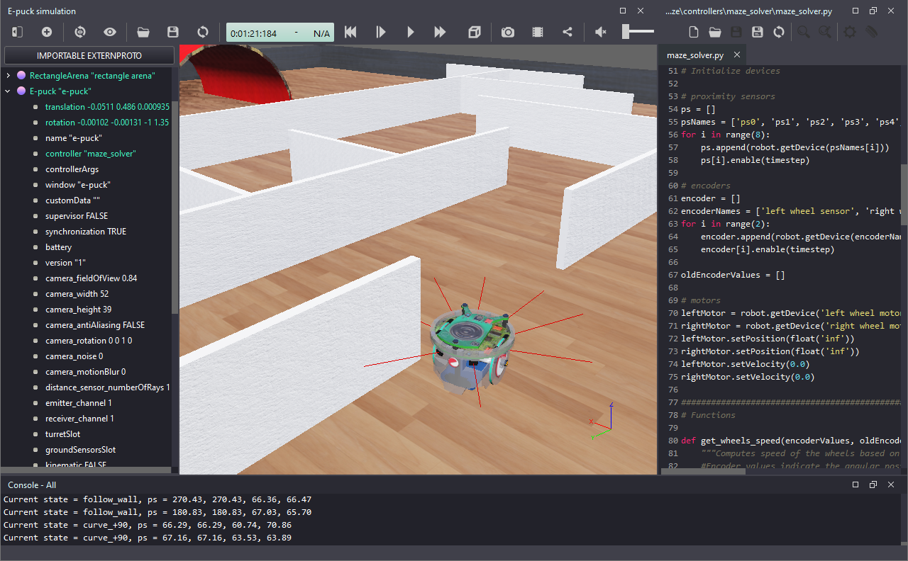

# Robotics Simulation Labs

Here you will find a set of tutorials to practice robotics concepts with [Webots Open-Source Robot Simulator](https://cyberbotics.com/) and [Python](https://www.python.org/). 

This page is available at: [https://felipenmartins.github.io/Robotics-Simulation-Labs/](https://felipenmartins.github.io/Robotics-Simulation-Labs/)

## Motivation

I teach an introductory-level course on Robotics for electrical engineering students, focusing on wheeled mobile robots. During the period of restrictions related to the COVID-19 pandemic (2020-2022), we ran and published the study **Teaching Practical Robotics During the COVID-19 Pandemic: A Case Study on Regular and Hardware-in-the-Loop Simulations** [[1]](https://link.springer.com/chapter/10.1007/978-3-031-21065-5_44), in which we describe our approach to allow engineering students to work from home: a set of simulation experiments and a Hardware-in-the-loop simulator. Our evaluation and student feedback in institutions in Portugal and in the Netherlands indicated the effectiveness of our proposal, which evolved into these **Robotics Simulation Labs**.

### Why Webots?

Considering mobile robotics, Webots has similar features [[2]](https://ieeexplore.ieee.org/document/9386154) and is more computationally efficient than other simulators such as Gazebo [[3]](https://arxiv.org/pdf/2008.04627). Webots is open-source, available for Windows, macOS and Linux, and is beginner-friendly, which makes it a good choice for an introductory-level course.

## How to use

The **Robotics Simulation Labs** are presented as a series of tutorials, including references to the official Webots tutorials, when relevant. The Labs are intended to be followed in sequence, starting from the first one.

Templates and solutions are presented for some labs, always in Python. They are compatible with the global coordinate system adopted as default by Webots since version R2022a. If you use an older version of Webots, please [see this note](/coordinate_system/ReadMe.md). 

If you make use of the content in this page, please cite [[1]](https://link.springer.com/chapter/10.1007/978-3-031-21065-5_44).

## Content

The content of each lab is listed below:

- [Lab 1](/Lab1/ReadMe.md) - Installation and configuration of Webots and Python
- [Lab 2](/Lab2/ReadMe.md) - Line-following Behavior with State Machine
- [Lab 3](/Lab3/ReadMe.md) - Vision-based Line-following Behavior
- [Lab 4](/Lab4/ReadMe.md) - Odometry-based Localization
- [Lab 5](/Lab5/ReadMe.md) - Go-to-goal Behavior with PID
- [Lab 6](/Lab6/ReadMe.md) - Trajectory Tracking Controller
- [Lab 7](/Lab7/ReadMe.md) - Combine Behaviors to Complete a Mission
- [Lab 8](/Lab8/ReadMe.md) - Hardware-in-the-Loop Simulation
- [Lab 9](/Lab9/ReadMe.md) - Path planning with Dijkstra
- [BONUS](/SoccerSim/ReadMe.md) - Robot Soccer Challenge

## Accompanying Jupyter Notebooks

Brief explanations of some concepts, including how to implement them in Python, are available as [Jupyter Notebooks](https://github.com/felipenmartins/jupyter-notebooks). These notebooks are useful for understanding the fundamentals because they allow step-by-step execution of the implemented functions without the need of running Webots. 

The available notebooks are:

1. [Implementation of simple robot behaviors](https://github.com/felipenmartins/Mobile-Robot-Control/blob/main/robot_behaviors.ipynb) for mobile robot control (related to [Lab 2](/Lab2/ReadMe.md))
2. [Selecting Behaviors with Finite-State Machines](https://github.com/felipenmartins/Mobile-Robot-Control/blob/main/finite-state_machines.ipynb) (also related to [Lab 2](/Lab2/ReadMe.md))
3. [Digital Image Processing](https://github.com/felipenmartins/Mobile-Robot-Control/blob/main/image_processing_example.ipynb) - fundamentals and basic functions (related to [Lab 3](/Lab3/ReadMe.md))
4. [Odometry-based Localization](https://github.com/felipenmartins/Mobile-Robot-Control/blob/main/odometry-based_localization.ipynb) for the differential-drive robot (related to [Lab 4](/Lab4/ReadMe.md))
5. [Mobile Robot Control with PID](https://github.com/felipenmartins/Mobile-Robot-Control/blob/main/robot_control_with_PID.ipynb) for a go-to-goal moving controller (related to [Lab 5](/Lab5/ReadMe.md))
6. [Dijkstra's Algorithm](https://github.com/felipenmartins/Mobile-Robot-Control/blob/main/path_planning_dijkstra.ipynb) for Robotic Path Planning (related to [Lab 9](/Lab9/ReadMe.md))

## Simple Robot Simulator

If you are looking for a simpler simulator, try [SimRobSim](https://github.com/felipenmartins/SimRobSim), which is a simple robot simulator built using Pygame. It simulates a differential-drive robot that uses Dijkstra's algorithm to define waypoints, and implements a path-following algorithm using PID.

## References

If you make use of the **Robotics Simulation Labs**, please cite [[1]](https://link.springer.com/chapter/10.1007/978-3-031-21065-5_44). Thanks!

[1] Lima, José, Felipe N. Martins, and Paulo Costa. "Teaching Practical Robotics During the COVID-19 Pandemic: A Case Study on Regular and Hardware-in-the-Loop Simulations." Iberian Robotics Conference. Cham: Springer International Publishing, 2022. Available at: [https://link.springer.com/chapter/10.1007/978-3-031-21065-5_44](https://link.springer.com/chapter/10.1007/978-3-031-21065-5_44)

[2] J. Collins, S. Chand, A. Vanderkop and D. Howard, "A Review of Physics Simulators for Robotic Applications," in IEEE Access, vol. 9, pp. 51416-51431, 2021, doi: 10.1109/ACCESS.2021.3068769. – Available at: [https://ieeexplore.ieee.org/document/9386154](https://ieeexplore.ieee.org/document/9386154).

[3] A. Ayala, F. Cruz, D. Campos, R. Rubio, B. Fernandes and R. Dazeley, "A Comparison of Humanoid Robot Simulators: A Quantitative Approach," 2020 Joint IEEE 10th International Conference on Development and Learning and Epigenetic Robotics (ICDL-EpiRob), Valparaiso, Chile, 2020, pp. 1-6, doi: 10.1109/ICDL-EpiRob48136.2020.9278116.  - Available at: [https://arxiv.org/pdf/2008.04627](https://arxiv.org/pdf/2008.04627)

## License

This project is licensed under the terms of the [MIT license](/LICENSE).
